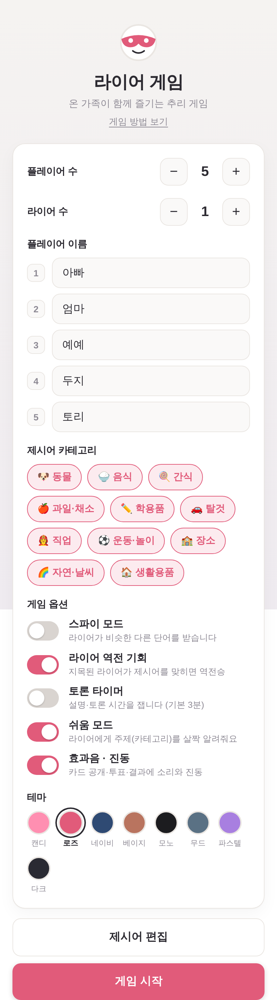
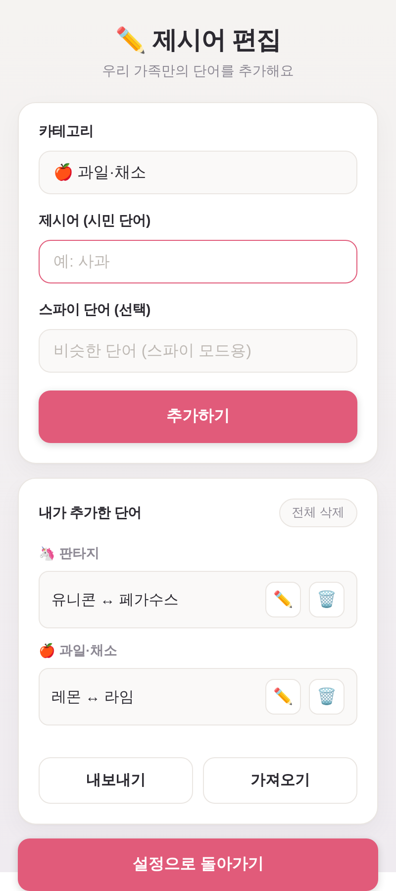
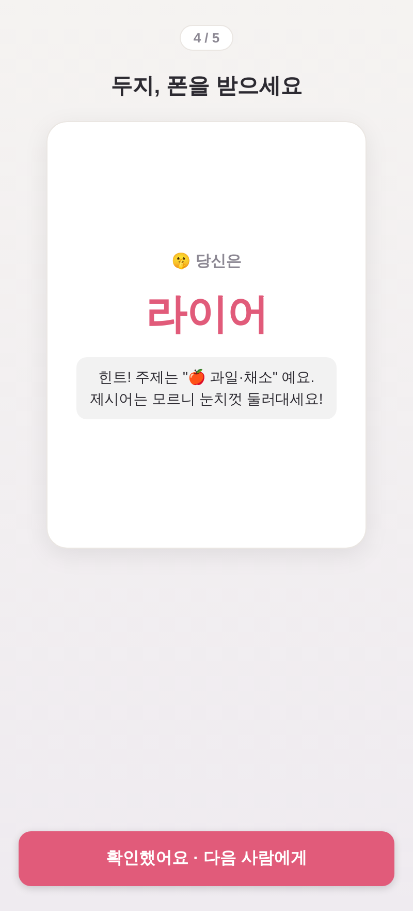
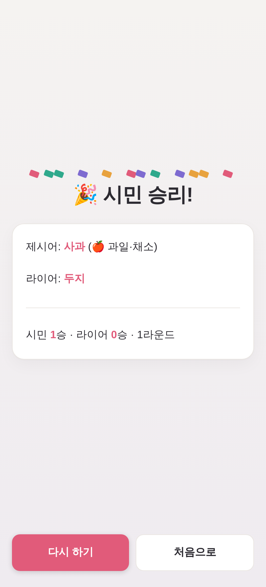

# 🎭 라이어 게임 (Liar Game)

한 기기를 돌려가며 즐기는 오프라인 파티 게임입니다. 서버 없이 순수 HTML/CSS/JavaScript로
만들어져 있어, 브라우저에서 파일을 열기만 하면 바로 플레이할 수 있습니다.

## 미리보기

| 설정 | 제시어 편집 | 라이어 카드 |
|:---:|:---:|:---:|
|  |  |  |
| **비밀 투표** | **투표 집계** | **결과(시민 승)** |
|  |  |  |

> 📱 휴대폰 브라우저에서 **홈 화면에 추가**하면 앱처럼 전체화면으로 실행되고, 한 번 열어두면 **오프라인**에서도 동작합니다(PWA).

## 플레이 방법

1. **설정**: 플레이어 수, 라이어 수, 제시어 카테고리, 옵션을 정합니다.
2. **역할 확인**: 폰을 한 명씩 돌려가며 자기 카드만 탭해서 확인합니다.
   - 시민은 공통 **제시어**를 봅니다.
   - 라이어는 제시어를 모릅니다(기본) 또는 비슷한 다른 단어를 받습니다(스파이 모드).
3. **토론**: 모두 모여 돌아가며 제시어를 한 마디씩 설명합니다.
4. **투표**: 가장 의심스러운 사람을 지목합니다.
5. **결과**: 라이어를 잡으면 시민 승! 단, *역전 기회* 옵션이 켜져 있으면
   지목된 라이어가 제시어를 맞혀 역전승할 수 있습니다.

## 옵션

| 옵션 | 설명 |
|------|------|
| 스파이 모드 | 라이어가 제시어 대신 *비슷한 다른 단어*를 받습니다. |
| 라이어 역전 기회 | 지목된 라이어가 제시어를 맞히면 역전승. |
| 토론 타이머 | 토론 시간을 3분으로 잽니다. |
| 쉬움 모드 | 라이어에게 주제(카테고리)를 살짝 알려줘 어린 친구도 쉽게 참여. |
| 카테고리 선택 | 동물·음식·간식·과일채소·학용품·탈것·직업·운동놀이·장소·자연날씨·생활용품(11종) 중 골라서 출제. |

또한:
- 🏆 **누적 점수판** — 시민/라이어 팀의 승수와 라운드를 기록 (초기화 버튼 제공)
- 🔁 **같은 단어 연속 방지** — 직전 라운드와 같은 제시어는 다시 나오지 않음
- 💾 **설정 자동 저장** — 새로고침해도 마지막 설정·점수가 유지됨 (localStorage)
- ✏️ **제시어 추가/편집** — 우리 가족만의 단어·카테고리를 직접 등록
- 📤📥 **내보내기/가져오기** — 추가한 단어를 JSON 파일로 저장하고 다른 기기에서 불러오기
- 📱 **PWA** — 홈 화면에 추가해 앱처럼 실행, 오프라인 지원
- 🙊 **비밀 투표** — 한 명씩 돌아가며 비밀 지목 → 집계 → 드럼롤 공개 (동점 시 재투표)
- 🔊 **효과음·진동** — 카드 공개·투표·결과 연출 (끌 수 있음, WebAudio 합성이라 파일 없음)
- 🎨 **테마 8종** — 캔디·로즈·네이비·베이지·모노·무드·파스텔·다크 (기기별 저장)
- 🧑‍🏫 **온보딩** — 처음 켜면 '게임 방법' 안내, 카드 배경색 통일로 엿보기 방지

> 제시어는 초등 3학년 ~ 중학 2학년 눈높이의 일상 단어 위주로 구성되어 있어요(총 170여 쌍). 자녀와 함께 즐기기 좋습니다.

## 실행

별도 설치 없이 `index.html`을 브라우저로 열면 됩니다.

```bash
# 로컬에서 간단히 띄우려면 (선택)
python3 -m http.server 8000
# 브라우저에서 http://localhost:8000 접속
```

## 배포

정적 파일이라 무료 호스팅에 그대로 올릴 수 있습니다(폴더 전체 업로드).
- GitHub Pages, Netlify, Vercel 등. PWA/오프라인을 쓰려면 `https`로 서빙해야 합니다.

## 파일 구조

```
index.html             화면 구조
style.css              스타일 (모바일 우선, 파스텔 캔디 테마)
app.js                 게임 로직 (상태 관리·역할 분배·판정·편집·입출력)
words.js               제시어 은행 (카테고리별 단어/스파이 단어 쌍)
manifest.webmanifest   PWA 매니페스트
sw.js                  서비스 워커 (오프라인 캐싱)
icons/                 앱 아이콘 (192/512)
screenshots/           미리보기 이미지
```

## 향후 확장 아이디어

- 각자 폰으로 접속하는 온라인 멀티플레이(Firebase/WebSocket)
- 난이도별 단어 태그(쉬움/어려움 단어 풀 분리)
- 플레이어 이름 직접 입력
